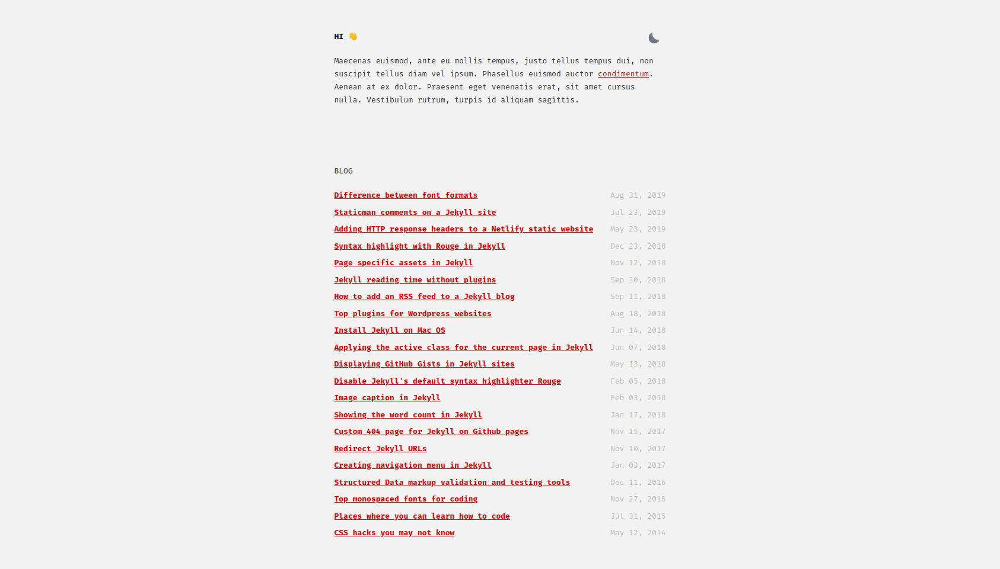
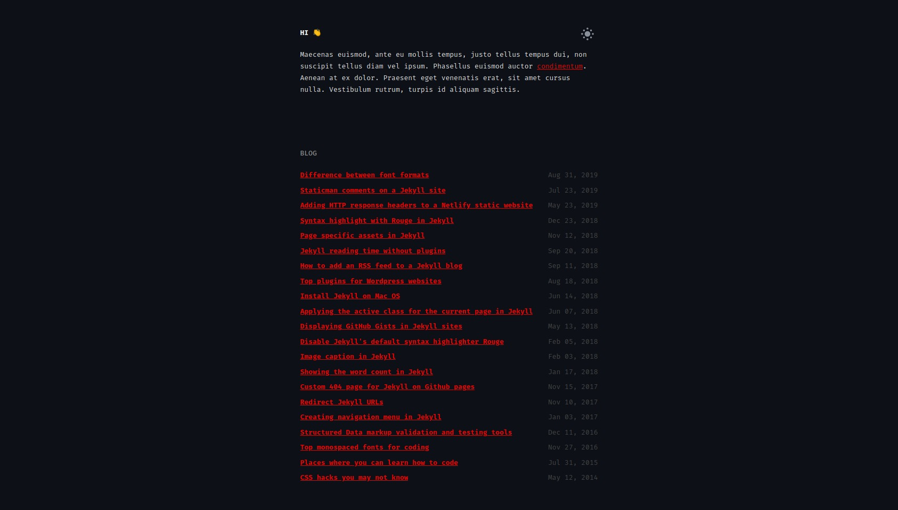

# Asko

Asko is a simple and minimalistic jekyll blogging theme. 
Forked from [Sidey theme](https://github.com/ronv/sidey).  
Thanks to [Asko Nõmm](https://www.askonomm.com/) that gave me permission to copy his blog theme.

### Features

- Responsive design
- Dark/Light theme
- Inline CSS
- Anchor headings
- Tags & tag pages
- Security headers (for Netlify hosting)
- 404 page
- Compressed CSS and HTML
- 100/100 score on Lighthouse, Page Speed Insights & Webpagetest
- Robots.txt
- Atom & Json feeds
- Sass
- Seo optimized (Twitter cards, Facebook Open Graph, Schema.org)
- Ultra fast (Only ~5kb of CSS)

### Screenshot

